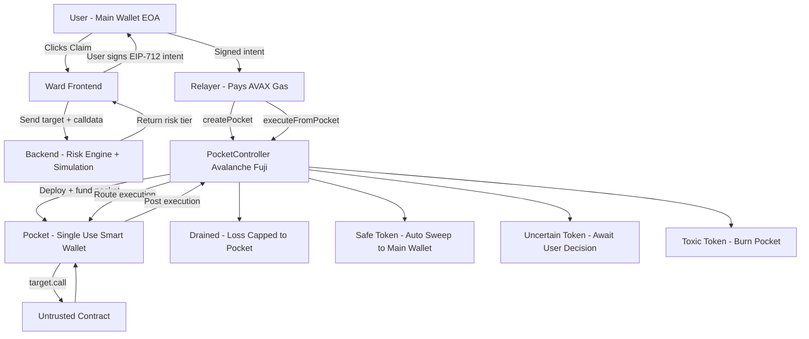

# HIGH LEVEL FLOW:

```markdown
┌───────────────────────────────┐
│            USER               │
│  EOA (Main Wallet)            │
│  - Identity only              │
│  - Signs EIP-712 intent       │
└───────────────┬───────────────┘
                │
                │ (1) Risky Action Initiated
                ▼
┌───────────────────────────────┐
│           FRONTEND            │
│  - Intercepts interaction     │
│  - Displays risk status       │
│  - Requests signature         │
└───────────────┬───────────────┘
                │
                │ (2) Metadata: target, calldata, chainId
                ▼
┌───────────────────────────────┐
│            BACKEND            │
│  Risk Engine + Simulation     │
│  - Static analysis            │
│  - Blacklist lookup           │
│  - Tier classification        │
│  - Fork simulation            │
└───────────────┬───────────────┘
                │
                │ (3) EIP-712 Intent Built
                ▼
┌───────────────────────────────┐
│             USER              │
│  Signs Intent (Gasless)       │
│  - Pocket address             │
│  - Target contract            │
│  - Calldata hash              │
│  - Nonce + Expiry             │
└───────────────┬───────────────┘
                │
                │ (4) Signed Intent
                ▼
┌───────────────────────────────┐
│            RELAYER            │
│  - Verifies format            │
│  - Pays AVAX gas              │
│  - Submits transactions       │
└───────────────┬───────────────┘
                │
                │ (5) createPocket()
                ▼
┌───────────────────────────────┐
│       POCKET CONTROLLER       │
│  - Deploy pocket (CREATE2)    │
│  - Fund with capped AVAX      │
│  - Record ownership           │
└───────────────┬───────────────┘
                │
                │ (6) executeFromPocket()
                ▼
┌───────────────────────────────┐
│            POCKET             │
│  Single-use smart wallet      │
│  - Verify signature           │
│  - Verify nonce + expiry      │
│  - Execute target.call()      │
│  - Mark as used               │
└───────────────┬───────────────┘
                │
                │ (7) Risky Execution
                ▼
┌───────────────────────────────┐
│      UNTRUSTED CONTRACT       │
│  Airdrop / DeFi / Token       │
└───────────────┬───────────────┘
                │
                │ (8) Result Handling
                ▼
┌────────────────────────────────────────────┐
│        POST-EXECUTION RESOLUTION           │
│                                            │
│  A) Drained → Mark COMPROMISED             │
│  B) Safe → Auto-sweep to main wallet       │
│  C) Uncertain → Await user confirmation    │
│  D) Toxic → Burn pocket                    │
└────────────────────────────────────────────┘

```

---

# User flow:

