# 🛡️ Ward Collateral

> **Non-Custodial Smart Collateral Protocol for Web3 Credit & BNPL — Built on BNB Chain**

[](https://opensource.org/licenses/MIT)
[](https://www.bnbchain.org/)
[]()
[](https://soliditylang.org/)
[]()
[]()

---

## The Problem

> *"Crypto payment and BNPL platforms rely on centralized custody and opaque liquidity to underwrite credit, creating counterparty risk and low transparency."*
> — BNB Hack Bengaluru 2026, Smart Collateral Track

Today's Web3 credit and BNPL systems have three structural failures:

**1. Centralized Custody** — Users must hand assets to a platform. If the platform is compromised, assets are gone. There is no smart contract enforcing custody — just trust.

**2. Opaque Underwriting** — Credit decisions happen off-chain, in black boxes. Users cannot verify how their creditworthiness is assessed, or whether collateral is actually backing their credit line.

**3. Counterparty Risk & Low Transparency** — Merchants, relayers, and platforms introduce hidden execution risks. A single malicious or buggy contract interaction can drain an entire collateral vault through approval exploits or reentrancy cascades.

The result: Web3 credit cannot scale. Users cannot trust it. Institutions cannot integrate it.

---

## What the Track Asks For

| Requirement | What It Means |
|---|---|
| **Non-custodial smart collateral** | Users retain ownership — assets locked in smart contracts, not held by admins |
| **Programmable vaults** | Vault logic (LTV, default, installments) is on-chain and deterministic |
| **Verifiable credit guarantees** | Collateral is provably locked when credit is issued — verifiable on-chain by anyone |
| **On-chain & oracle-assisted default logic** | Default enforcement requires no human — triggered by timestamp and repayment state |
| **Trust-minimized Web3 credit** | No centralized underwriting, no backend authority over credit decisions |
| **No surrender of asset custody** | Users can always withdraw collateral when no active loans exist |

Ward satisfies every requirement — and goes one step further with execution isolation.

---

## What Ward Builds

Ward is a **non-custodial smart collateral protocol** that solves all three problems above and introduces a new safety primitive on top: **execution isolation via disposable pockets**.

```
┌─────────────────────────────────────────────────────────────┐
│                    WARD COLLATERAL                          │
│                                                             │
│  WHAT THE TRACK ASKS FOR      +    WHAT WARD ADDS          │
│  ───────────────────────           ───────────────         │
│  ✔ Non-custodial vault             ✔ Execution isolation   │
│  ✔ Programmable LTV                ✔ Disposable Pocket     │
│  ✔ On-chain credit guarantee       ✔ Single-use execution  │
│  ✔ Deterministic default logic     ✔ Vault structurally    │
│  ✔ Trust-minimized credit              unreachable from    │
│  ✔ No custody surrender                merchant contracts  │
└─────────────────────────────────────────────────────────────┘
```

---

## Architecture


### Contract Responsibilities

| Contract | Responsibility |
|---|---|
| `CollateralVault.sol` | Accepts deposits · enforces 70% LTV · allocates BNPL credit · tracks installments · handles on-chain liquidation |
| `PocketController.sol` | Deploys pockets deterministically (CREATE2) · funds gas reserve · routes signed execution |
| `Pocket.sol` | Single-use EIP-712 execution sandbox · executes exactly once · replay-proof |
| `PocketFactory.sol` | Minimal bytecode deployment under deterministic addresses |
| `MerchantGood.sol` | Demo: legitimate payment flow |
| `MerchantMalicious.sol` | Demo: drain attempt — proves pocket isolation in action |

---

## Pillar 1 — Non-Custodial Programmable Vault

Users deposit BNB into `CollateralVault` — a smart contract with no admin withdrawal key. All credit logic is enforced deterministically on-chain.

```solidity
// Credit capacity computed purely from on-chain state — no backend involved
function availableCredit(address user) public view returns (uint256) {
    uint256 capacity = positions[user].deposited * LTV_PERCENT / 100;
    return capacity - positions[user].borrowed;
}
```

**What this means in practice:**
- No platform holds user funds — ever
- No admin can move deposited collateral
- Credit capacity is verifiable by anyone, at any time, on-chain
- Users withdraw freely when `positions[user].borrowed == 0`

---

## Pillar 2 — Verifiable Credit Guarantees

When a user requests credit, the vault locks the allocation immediately and deterministically. The merchant has an on-chain guarantee: collateral is verifiably committed.

```mermaid
flowchart LR
    A[User calls requestCredit] --> B[Vault checks: deposited × 70% ≥ borrowed + amount]
    B -->|passes| C[borrowed += principal]
    C --> D[Pocket deployed + funded]
    D --> E[CreditRequested event emitted]
    E --> F[On-chain state readable by any party ✓]
```



The `CreditRequested` event carries: `requestId`, `pocket address`, `principal`, `installmentAmount`, `totalInstallments`, `nextDueDate`. Anyone can verify the credit guarantee by reading vault state — no trust in the platform required.

---

## Pillar 3 — On-Chain Default Logic

Default enforcement is timestamp-based, deterministic, and callable by anyone. No admin trigger. No oracle dependency in the base model.

```solidity
// Permissionless — anyone can call after due date passes
function liquidate(bytes32 requestId) external {
    CreditPosition storage loan = creditPositions[requestId];
    require(block.timestamp > loan.nextDueDate, "Not yet overdue");
    require(!loan.closed && !loan.defaulted, "Already resolved");

    loan.defaulted = true;
    positions[loan.borrower].borrowed -= loan.principal;

    emit LoanDefaulted(requestId, loan.borrower);
}
```

**Guarantees:**
- No admin key required to trigger default
- Default is transparent, auditable, and irreversible on-chain
- Credit-capacity penalty model: `borrowed` released on default, preventing re-borrowing
- Overdue threshold is `block.timestamp > loan.nextDueDate` — no room for manipulation

> Oracle-assisted dynamic LTV (Chainlink / TWAP) is scoped for Q2 to enable price-sensitive collateral ratios.

---

## Pillar 4 — Trust-Minimized Credit

Ward has no backend credit authority. The backend is a relayer and advisory layer only.

| Decision | Where it lives |
|---|---|
| Can this user borrow? | `CollateralVault.availableCredit()` — on-chain |
| Is this merchant blocked? | `CollateralVault.merchantBlocked` — on-chain |
| Is this loan defaulted? | `CollateralVault.creditPositions[id].defaulted` — on-chain |
| Merchant risk classification | Backend advisory only — informational, not enforceable |
| Execute transaction | User-signed EIP-712 intent — relayer cannot forge |

The vault decides everything. The backend pays gas.

---

## Pillar 5 — No Asset Custody Surrender

Users retain full ownership of their collateral. The vault is a smart contract — there is no admin key, no platform withdrawal function, no custodian.

```solidity
// Users withdraw freely when no active loans
function withdraw(uint256 amount) external {
    require(positions[msg.sender].deposited - positions[msg.sender].borrowed >= amount);
    positions[msg.sender].deposited -= amount;
    payable(msg.sender).transfer(amount);
}
```

At no point does the protocol take custody. Collateral is locked by code, not by a company.

---

## Ward's Innovation: The Execution Isolation Pocket

This is what Ward adds beyond what the track requires.

### The Execution Risk Gap

Even a perfectly designed collateral vault can be exploited through execution risk. When a user interacts with a malicious merchant:

- Approval exploits can sweep vault balances
- Reentrancy can cascade across multiple positions
- Infinite allowance attacks drain beyond the intended amount
- One wrong signed transaction can be catastrophic

Traditional smart collateral has no structural answer to this. Ward does.

### The Pocket Primitive

For every credit request, Ward creates a **disposable execution pocket** — a single-use smart contract wallet funded with only the allocated credit amount.

```
CollateralVault (10 BNB — safe, structurally isolated)
        │
        │  allocates 1 BNB
        ▼
  Disposable Pocket  (1 BNB — the only exposed surface)
        │
        │  executes exactly once via EIP-712 signed intent
        ▼
  Merchant Contract  (safe or malicious)

  Result A — Merchant legitimate:  Payment succeeds. Pocket marked used. Vault untouched.
  Result B — Merchant malicious:   Pocket drained. Vault: structurally unreachable.
```

### How Pockets Work

**Created per credit request** — The pocket doesn't exist until `requestCredit()` is called. One loan = one fresh pocket. Zero reuse across loans.

**Deterministic address (CREATE2)** — The pocket address is computable before deployment. The user signs an EIP-712 intent scoped to that specific address, target, calldata, nonce, and expiry — before the pocket even exists on-chain.

**Single-use enforcement** — `Pocket.exec()` sets `used = true` atomically before the external call. Replay is structurally impossible — not a policy, not a check, the architecture.

**Vault isolation** — The vault never calls merchants. The vault never approves merchants. The vault has zero code path that reaches external contracts. This is not a security policy — it is how the system is built.

### Pocket Lifecycle


### Pocket Security Properties

| Property | How It's Enforced |
|---|---|
| Value-capped exposure | Pocket holds only the credit allocation — funded by vault at creation |
| Replay prevention | `used = true` set before external call — structural, not policy |
| No approval inheritance | Pocket is a fresh contract — zero pre-existing approvals |
| Vault isolation | Vault has no code path to merchant — no shared state |
| Deterministic address | User signs against known address (CREATE2) before deployment |
| Independent per-loan | N loans = N independent pockets — no cross-loan contamination |

---

## Full User Journey

```mermaid
flowchart TB
    A[Deposit 10 BNB into CollateralVault] --> B[availableCredit = 10 × 70% = 7 BNB]
    B --> C[Call requestCredit: 1 BNB · 4 installments · 30-day interval]
    C --> D[Vault: check merchant not blocked + LTV sufficient]
    D --> E[borrowed += 1 BNB · Pocket deployed via CREATE2 · Pocket funded 1 BNB]
    E --> F[CreditRequested event emitted: pocket address · nextDueDate · installmentAmount]
    F --> G[User signs EIP-712: pocket · target · calldata · nonce · expiry]
    G --> H[Relayer calls PocketController.executeFromPocket]
    H --> I{Merchant outcome}
    I -->|Legitimate| J[Purchase succeeds. Pocket marked used ✓]
    I -->|Malicious| K[Pocket drained. Vault 10 BNB untouched ✓]
    J --> L[User repays 4 × 0.25 BNB installments]
    K --> L
    L -->|All paid| M[Loan closed · borrowed -= 1 BNB · credit restored]
    L -->|Due date missed| N[Anyone calls liquidate · defaulted = true · borrowed released]
```



---

## Credit & Installment Model

### LTV Formula
```
creditCapacity = deposited × 70%
availableCredit = creditCapacity - borrowed
```

### BNPL Installment Accounting
```
Principal:     1 BNB
Installments:  4 × 0.25 BNB
Interval:      30 days per installment

borrowed stays at 1 BNB throughout repayment.
It decreases ONLY when:
  → All installments repaid  →  loan.closed = true   →  borrowed -= principal
  → Overdue & liquidated     →  loan.defaulted = true →  borrowed -= principal
```

No mid-loan credit recycling. No off-chain debt mutation.

### Worked Example

| State | Deposited | Borrowed | Available Credit |
|---|---|---|---|
| After deposit | 10 BNB | 0 | 7 BNB |
| After 1 BNB loan issued | 10 BNB | 1 BNB | 6 BNB |
| After 2 installments paid | 10 BNB | 1 BNB | 6 BNB ← unchanged mid-loan |
| After loan fully closed | 10 BNB | 0 | 7 BNB ← fully restored |

---

## Attack Containment Matrix

| Risk | Traditional BNPL | Ward |
|---|---|---|
| Centralized custody | ❌ Platform holds funds | ✔ Smart contract · no admin key |
| Opaque credit | ❌ Off-chain black box | ✔ `availableCredit()` on-chain · verifiable |
| Malicious merchant | ❌ Full vault drain | ✔ Pocket only · vault unreachable |
| Approval exploit | ❌ Vault exposed | ✔ No approval granted · single-use pocket |
| Reentrancy cascade | ❌ Cross-position risk | ✔ Pocket isolated per-loan |
| Default without governance | ❌ Requires admin action | ✔ Permissionless `liquidate()` |
| Price volatility | ✔ LTV liquidation | ✔ LTV liquidation |
| Credit decision off-chain | ❌ Backend controls credit | ✔ All decisions in vault code |

---

## Deployed Contracts — BSC Testnet (Chain ID: 97)

> RPC: `https://data-seed-prebsc-1-s1.bnbchain.org:8545`

| Contract | Address | Explorer |
|---|---|---|
| `CollateralVault` | `0xf696d0f64631871DED01b1212fA0b9402525a39E` | [View →](https://testnet.bscscan.com/address/0xf696d0f64631871DED01b1212fA0b9402525a39E) |
| `PocketController` | `0x5DfeeA17F14E1ea2f93B45fF91e9E57a8e393245` | [View →](https://testnet.bscscan.com/address/0x5DfeeA17F14E1ea2f93B45fF91e9E57a8e393245) |
| `PocketFactory` | `0xB0019c4f6e89899CAFc586e3BCf105717346d65F` | [View →](https://testnet.bscscan.com/address/0xB0019c4f6e89899CAFc586e3BCf105717346d65F) |
| `MerchantGood` | `0x2f133abe75C46CD43C81358441512990CF39B48E` | [View →](https://testnet.bscscan.com/address/0x2f133abe75C46CD43C81358441512990CF39B48E) |
| `MerchantMalicious` | `0xb79C03A81E31B289bD9D40BE87d3f434A1B6B6dc` | [View →](https://testnet.bscscan.com/address/0xb79C03A81E31B289bD9D40BE87d3f434A1B6B6dc) |

### Governance & Config

| Parameter | Value |
|---|---|
| Vault Owner | `0x14e0D556fFe746BC5ab12902423bDa63DeA08Bf9` |
| Treasury | `0x2acfF541cf34B190276eB65a082cB16378aDF9D8` |
| LTV | 70% |
| Gas Reserve per Pocket | 0.1 BNB |

### Fee Tiers (Merchant Risk-Adjusted)

| Tier | Classification | Fee |
|---|---|---|
| Tier 2 | Safe | 2% (200 bps) |
| Tier 4 | Provisional | 3% (300 bps) |
| Tier 3 | Risky | 8% (800 bps) |

---

## Key On-Chain Invariants

```solidity
// 1. LTV enforced on every credit request — no backend override possible
require(availableCredit(msg.sender) >= amount, "Insufficient credit capacity");

// 2. Merchant blocklist enforced before any pocket is deployed
require(!merchantBlocked[merchant], "Merchant is blocked");

// 3. Pocket is single-use — set atomically before external call
require(!used, "Pocket: already used");
used = true;

// 4. Default is permissionless — anyone calls after due date
require(block.timestamp > loan.nextDueDate, "Not yet overdue");

// 5. Borrowed only decreases on close or liquidation — never mid-loan
// repayInstallment(): borrowed unchanged until loan.remaining == 0
// liquidate():        borrowed -= principal on default
```

---

## Test Coverage

```bash
forge test -vv
```

**41+ passing tests** covering:

- LTV boundary enforcement (exact capacity, over-limit rejection)
- Pocket single-use enforcement (replay attack prevention)
- Vault isolation invariant (vault-drain attempt proof)
- Nonce replay prevention across pockets
- Installment accounting (partial repay, full repay, overpay guard)
- Liquidation edge cases (exact timestamp, blocks-past-due)
- Malicious merchant drain containment
- Merchant governance (flag / block / unblock)
- Borrowed accounting integrity across open + closed + defaulted loans

---

## Demo Scenarios

### Scenario A — Normal BNPL Purchase

1. Deposit 10 BNB → `availableCredit()` returns 7 BNB
2. Call `requestCredit(merchantGood, 1 BNB, 4 installments, 30 days, salt)`
3. Vault verifies LTV, increments `borrowed`, deploys pocket, funds with 1 BNB
4. User signs EIP-712 intent → relayer calls `executeFromPocket`
5. `MerchantGood` receives 1 BNB, pocket marked `used`
6. User repays 4 × 0.25 BNB → loan closed → credit restored

**Outcome:** Standard Web3 BNPL with verifiable on-chain credit guarantee. Collateral never touched by merchant. ✓

---

### Scenario B — Malicious Merchant (Isolation Proof)

1. Deposit 10 BNB → vault holds collateral
2. Call `requestCredit(merchantMalicious, 1 BNB, ...)` → pocket funded with 1 BNB only
3. User signs EIP-712 intent → relayer executes
4. `MerchantMalicious` attempts to drain everything it can reach
5. Pocket contains 1 BNB — that is the entire accessible attack surface
6. Vault holding 10 BNB has no code path reachable from the merchant

**Outcome:** Pocket drained (1 BNB max loss — bounded by design). Vault: 10 BNB intact. Isolation proven. ✓

---

## How to Run

### Docker (Recommended for Judges)

```bash
git clone https://github.com/your-org/ward-collateral
cd ward-collateral
docker-compose up --build
```

Starts: Foundry local fork · Backend relayer API · Frontend demo

### Local Setup

```bash
# Install and build
forge install && forge build

# Run full test suite
forge test -vv

# Deploy to BSC Testnet
forge script script/Deploy.s.sol \
  --rpc-url https://data-seed-prebsc-1-s1.bnbchain.org:8545 \
  --broadcast --verify

# Environment
cp .env.example .env
# Fill in: PRIVATE_KEY, BNB_TESTNET_RPC, BSCSCAN_API_KEY
```

---

## Tech Stack

### Smart Contracts Layer

| Component | Technology | Version |
|---|---|---|
| Language | Solidity | 0.8.24 |
| Framework | Foundry (Forge) | Latest |
| Libraries | OpenZeppelin Contracts | v5.6.0 |
| Standard Library | forge-std | v1.9.6 |
| Chain | BNB Smart Chain (BSC) Testnet | Chain ID 97 |
| RPC | BSC Testnet RPC | `https://data-seed-prebsc-1-s1.bnbchain.org:8545` |

### Backend (Relayer/API)

| Component | Technology | Version |
|---|---|---|
| Runtime | Node.js | 18-alpine |
| Framework | Express.js | 5.2.1 |
| Web3 Library | ethers.js | 6.16.0 |
| Dev Server | nodemon | 3.1.11 |
| CORS | cors | 2.8.6 |
| Env Manager | dotenv | 17.2.3 |
| Package Manager | npm | (bundled with Node 18) |
| Port | | 3000 |

### Frontend (UI/Dashboard)

| Component | Technology | Version |
|---|---|---|
| Framework | React | 18.3.1 |
| Build Tool | Vite | 7.3.1 |
| Language | TypeScript | 5.9.3 |
| Web3 Libraries | ethers.js | 6.16.0 |
| | viem | 2.45.1 |
| | wagmi | 2.19.5 |
| Wallet Integration | RainbowKit | 2.2.10 |
| Routing | react-router-dom | 6.20.0 |
| React Types | @types/react | 18.3.3 |
| | @types/react-dom | 18.3.0 |
| Vite Plugin | @vitejs/plugin-react | 5.1.3 |
| Port | | 5173 |

### Infrastructure & Containerization

| Component | Technology |
|---|---|
| Container Orchestration | Docker Compose 3.8 |
| Backend Container | Node 18-alpine |
| Frontend Container | Node 18-alpine |
| Smart Contract Container | ghcr.io/foundry-rs/foundry:latest |

### Key Web3 Integrations

* **EIP-712**: Typed structured data signing for pocket execution intents
* **CREATE2**: Deterministic pocket contract deployment
* **MetaMask/Web3 Wallets**: User wallet integration via wagmi + RainbowKit
* **Event Indexing**: Backend indexes on-chain contract events

### Development & Testing

* **Testing Framework**: Foundry Test Suite (41+ passing tests)
* **Gas Reporting**: Built-in Forge gas reports
* **Hot Reload**: nodemon (backend), Vite HMR (frontend)

**Summary**: Ward is a **Solidity + React + Node.js** full-stack Web3 project with **Foundry** for smart contracts, **Express.js** for the relayer backend, **Vite/React** for the frontend UI, **ethers.js/wagmi** for blockchain interactions, and **Docker Compose** for containerization — all deployed on BNB Smart Chain Testnet.

---

## Roadmap

### Q1 2026 — MVP (Delivered)
- [x] Non-custodial `CollateralVault` with 70% LTV
- [x] BNPL installment accounting (fully on-chain)
- [x] Permissionless on-chain liquidation
- [x] Execution isolation via disposable pockets
- [x] Deterministic pocket addresses (CREATE2 + EIP-712)
- [x] Merchant governance (flag / block / unblock)
- [x] 41+ passing tests · Deployed on BSC Testnet

### Q2 2026 — Depth
- [ ] Dynamic LTV via Chainlink oracle price feeds
- [ ] On-chain credit scoring from repayment history
- [ ] Gas sponsorship (ERC-4337 paymaster integration)
- [ ] Installment grace period + partial default logic

### Q3 2026 — Scale
- [ ] Multi-asset collateral (ERC-20, wrapped assets)
- [ ] Wallet SDK for BNPL integration
- [ ] Venus / PancakeSwap composability
- [ ] Cross-chain credit routing

---

## Limitations & Honest Assessment

- Pocket funds can still be lost to malicious merchants — Ward bounds but does not eliminate loss
- Dynamic LTV and oracle integration are Q2 (MVP uses fixed 70%)
- Backend merchant classification is advisory only — block/unblock is the on-chain enforcement layer
- Liquidation uses a credit-capacity penalty model, not physical collateral seizure in current MVP
- Controller gas reserve depletion would stall execution (operational risk, not architectural)

---

## Track Alignment Summary

| Track Requirement | Ward Implementation |
|---|---|
| Non-custodial smart collateral | `CollateralVault` — no admin withdrawal key |
| Programmable vaults | LTV · BNPL installments · default · governance — all on-chain |
| Verifiable credit guarantees | `CreditRequested` event + on-chain state readable by any party |
| On-chain default logic | Permissionless `liquidate()` after `nextDueDate` passes |
| Oracle-assisted default | Chainlink dynamic LTV scoped for Q2 |
| Trust-minimized credit | No backend credit authority — vault is the single source of truth |
| No asset custody surrender | `withdraw()` available whenever `borrowed == 0` |
| **Ward's addition** | **Execution isolation via disposable pockets — novel Web3 credit primitive** |

---

## License

MIT — see [LICENSE](./LICENSE)

---

## Built at BNB Hack Bengaluru 2026

Ward was designed and built during **BNB Hack Bengaluru 2026** in response to the Smart Collateral for Web3 Credit & BNPL track.

The track asks for non-custodial collateral, programmable vaults, and trustless credit. Ward delivers all of that — and adds execution isolation as the missing safety layer that makes Web3 credit viable at scale.

---

<p align="center">
  <b>Ward Collateral — Non-Custodial. Programmable. Execution-Safe.</b><br><br>
  <em>We don't assume merchants are honest. We build systems where the damage is bounded.</em>
</p>