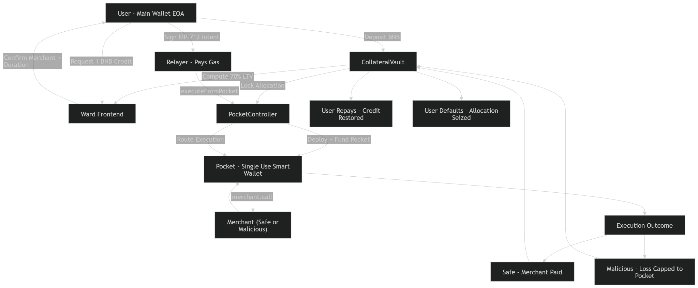

# Project: Problem, Solution & Impact

One place for the **what** and **why** of your project. Replace the headings below with your content.

# Full System Flow

## We also provide Merchant Risk Governance

- Any user can flag a merchant
- Flag counter increments on-chain
- Admin can block merchant
- Admin can unblock merchant
- Blocked merchant prevents new credit requests
---

## 1. Problem

Ward solves a concrete gap in Web3 credit: execution risk. Existing on‑chain BNPL and collateral systems focus on price risk (liquidations, oracles, LTV) but leave users exposed when they interact with malicious or buggy merchant contracts. A single unsafe call can cascade into a full vault drain when wallets or platforms grant excessive on‑chain authority.

Who is affected:
- Retail users who use on‑chain BNPL and payment flows
- Wallets and relayers that mediate execution
- Protocols that rely on composable interactions (DeFi integrations, airdrops)

Why it matters:
- Exploits involving merchant contracts and approvals are common and catastrophic
- As on‑chain commerce grows, the exposure multiplies across users and integrations
- Containing execution risk is necessary for mainstream adoption of Web3 credit

---

## 2. Solution

Ward introduces Execution‑Isolated Smart Collateral: a simple, auditable separation of credit accounting and execution authority.

High-level approach:
- Keep collateral and credit accounting on a hardened `CollateralVault` contract
- Allocate credit by creating a single‑use `Pocket` contract (created via `PocketController`) and funding it with only the allocated amount
- Require the user to sign an EIP‑712 scoped intent that authorizes exactly one pocket call (target, calldata, nonce, expiry)
- Route execution through a relayer via the `PocketController.executeFromPocket` entrypoint

Key features:
- Deterministic pocket addresses (CREATE2) for preview and signing
- Single‑use execution, enforced on‑chain
- Explicit backend relayer and classification — advisory only

Why this works:
- The main vault never directly interacts with merchants and never grants approvals
- Compromises are strictly capped to the pocket balance
- UX remains familiar: users sign and the backend/relayer handles execution

**Optional — user journey (Mermaid):** A diagram helps judges see the flow at a glance. Example:

Replace with your own steps (e.g. Connect wallet → Deposit → Earn → Withdraw). You can use `flowchart`, `journey`, or `sequenceDiagram` depending on what you want to show.

---

## 3. Business & Ecosystem Impact

Target users and adoption path:
- Consumers using BNPL and microcredit on BNB Chain
- Wallets that want to add a safety layer for risky interactions
- Merchants and payment integrators seeking safer payment rails

Value to the ecosystem:
- Reduces systemic execution risk by making each risky call bounded and observable
- Lowers bar for wallet and dApp integrations since Vault never exposes collateral

Monetization:
- Protocol fees on credit allocation or repayment
- Pocket exposure fees for relayers
- SDK and integration licensing for wallets and merchants

---

## 4. Limitations & Future Work

Current limitations:
- Pocket funds can still be lost; Ward limits but does not eliminate loss
- No dynamic LTV or oracle integration in the current MVP
- Backend classification is advisory and depends on the relayer/analysis

Future work:
- Dynamic LTV via price oracles
- On‑chain credit scoring and reputation linking
- Auto‑sweep policies for vetted tokens (policy + on‑chain rules)
- Multi‑asset collateral and cross‑chain routing

Open validations:
- Usability testing for signature UX
- Invariant checks across refunds, repay and liquidation flows