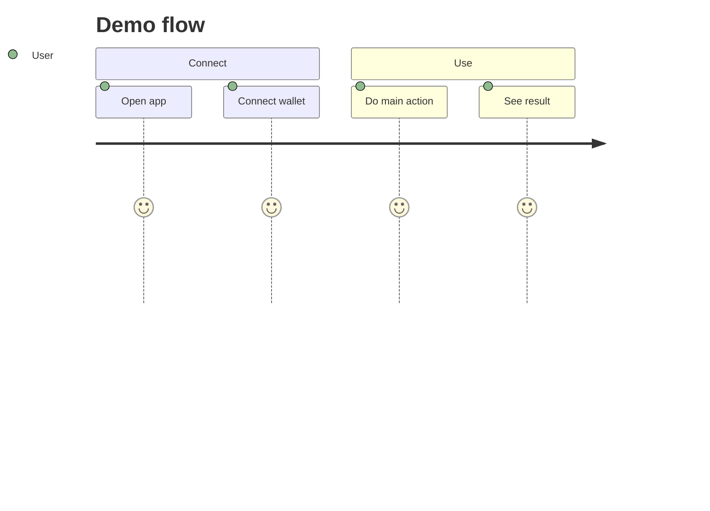

# Technical: Architecture, Setup & Demo

One place for **how** the system works and how to run and use it. Replace the sections below with your content.

**Tip:** Use [Mermaid](https://mermaid.js.org/) to draw architecture, data flow, and user flows. GitHub and most doc platforms render Mermaid in fenced code blocks with ` ```mermaid `.

---

## 1. Architecture

System overview

Ward is composed of three main layers:

- Frontend: React + Vite app (`ward-frontend`) — user interface for deposits, credit requests, signing EIP‑712 intents and viewing activity.
- Backend: Express API (`ward-backend`) — indexes on‑chain events, classifies merchant code, offers relayer/relay endpoints and admin routes; also calls owner‑only Vault methods when configured with the owner key.
- On‑chain: Solidity contracts (`contracts/src`) — `CollateralVault`, `PocketController`, `Pocket`, and `PocketFactory` implement credit accounting and execution isolation.

Component diagram (Mermaid):

```mermaid
flowchart TB
    UI[Frontend (Vite/React)] --> API[Backend (Express)]
    API --> SC[CollateralVault + PocketController]
    SC --> API
    UI -->|EIP-712 signatures| SC
```

Data flow highlights
- User deposits via the frontend → backend displays state → user requests credit → on‑chain `CollateralVault.requestCredit` deploys pocket and funds it → user signs intent → relayer executes pocket → events are indexed by backend and displayed in UI.

On‑chain vs off‑chain
- Critical state and enforcement (LTV, loan bookkeeping, single‑use pockets) live on‑chain.
- Advisory logic (bytecode classification, simulation, risk tiers) runs off‑chain in the backend and informs the UX; it cannot change on‑chain outcomes.

Security
- Minimal on‑chain attack surface for collateral (vault never calls merchant)
- Backend does static analysis and simulation but is advisory only
- Pockets constrain execution and fund exposure

---

## 2. Setup & Run

Prerequisites

- Docker & docker-compose (recommended)
- Node 18+ for local development
- MetaMask or other wallet connected to BSC Testnet (chain id 97)

Environment

Create a `.env` file in the repo root or set environment variables for:

- `RPC_URL` — BSC / opBNB testnet RPC (used by backend and foundry when set)
- `CONTROLLER_PRIVATE_KEY` — backend signer key (only for admin flows; keep secret)
- `CONTROLLER_ADDRESS` — optional (address of controller / owner)
- `COLLATERAL_VAULT_ADDRESS` — deployed vault address for frontend/backend
- Frontend Vite variables: `VITE_BACKEND_URL`, `VITE_RPC_URL`, `VITE_FACTORY_ADDRESS`, `VITE_CONTROLLER_ADDRESS`, `VITE_VAULT_ADDRESS`, `VITE_MERCHANT_GOOD_ADDRESS`, `VITE_MERCHANT_MALICIOUS_ADDRESS`, `VITE_CHAIN_ID`

Install & build (local, non-docker)

```bash
# backend
cd ward-backend
npm install

# frontend
cd ../ward-frontend
npm install

# contracts (foundry)
cd ../contracts
forge install
forge build
```

Run with Docker Compose (recommended)

```bash
cd docker
docker-compose up --build
```

Notes:
- Backend listens on port 3000 and the frontend on 5173 by default as configured in `docker/docker-compose.yml`.
- The `contracts` service runs a Foundry image; use `docker-compose run contracts bash -lc 'forge test'` to run tests inside the container.

Verify

- Open the frontend at `http://localhost:5173` and connect a wallet to BSC Testnet
- Use the dashboard to deposit tBNB, request credit, sign an intent and relay execution
- Check backend logs for indexed `CreditRequested`, `InstallmentRepaid`, and `PocketCreated` events

---

## 3. Demo Guide

Access

- With docker: `docker-compose up --build` then open `http://localhost:5173`
- Locally: run backend `npm run dev` in `ward-backend`, run frontend `npm run dev` in `ward-frontend` and open Vite URL

User flow

1. Connect wallet (BSC Testnet)
2. Deposit test tBNB using the Deposit card
3. Enter a merchant address and press "Check Merchant"
4. Request credit (Buy with Ward) — this creates a pocket and funds it on-chain
5. Sign execution intent shown by the UI (EIP‑712) and have relayer execute the pocket
6. Observe execution results in Activity → Recent Executions
7. If applicable, repay installments using the Repay button

Troubleshooting

- Wrong network: switch wallet to BSC Testnet (chain id 97)
- Missing env: ensure `VITE_VAULT_ADDRESS` and backend `COLLATERAL_VAULT_ADDRESS` are set
- Backend errors: check logs for owner key mismatch when calling admin routes (block/unblock)

**Optional — demo user journey (Mermaid):** A small diagram makes the flow easy for judges to follow:



Or use a `flowchart` with your real steps. This complements the written steps above.